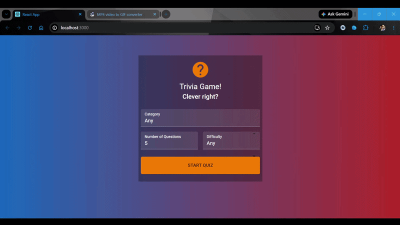

# Trivia App

A browser-based trivia quiz application built with React and Redux, featuring customizable quiz settings and real-time scoring.



## Features

- Customizable quiz settings (category, difficulty, number of questions)
- Countdown timer for each question
- Overlay system for answer feedback (Correct, Wrong, Time's Up)
- Quit confirmation dialog
- Detailed results review showing:
  - Score and percentage
  - Your chosen answers
  - Correct answers for missed questions
  - Time's Up status for unanswered questions
- Responsive design with mobile support
- Loading overlay with cancel functionality
- Error handling for connection failures

## Tech Stack

- React (functional components, hooks)
- Redux (state management)
- Material-UI (UI components)
- CSS3 (flexbox, animations, gradients, clamp() for responsive typography)

## External API

This app uses the [Open Trivia Database API](https://opentdb.com/api_config.php) to fetch trivia questions. The API provides:
- Multiple categories (General Knowledge, Science, History, Entertainment, etc.)
- Difficulty levels (Easy, Medium, Hard)
- Multiple choice questions with encoded HTML entities

## Running Locally

1. Clone the repository
2. Install dependencies:
   ```bash
   npm install
   ```
3. Start the development server:
   ```bash
   npm start
   ```
4. Open http://localhost:3000 in your browser

## Dependencies

- react
- react-dom
- react-redux
- @reduxjs/toolkit
- @material-ui/core
- @material-ui/icons
- html-entities
- express

## Notes

- Uses Node.js legacy OpenSSL provider for compatibility with older react-scripts
- Postcss version 7.0.36 forced via resolutions for dependency compatibility
